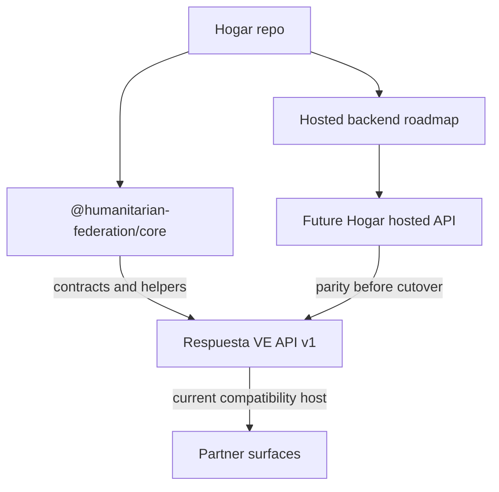

# feat: Clarify Hogar Hosted Backend Boundary

## Overview

Hogar needs to become the clear platform center of gravity without destabilizing
the live Respuesta VE API. This plan updates the Hogar repo to state the current
truth: `https://respuestave.org/api/v1` is the first production compatibility
host for Hogar-compatible API contracts today, while reusable hosted-backend
ownership, parity gates, and future extraction work belong in Hogar.

The work is intentionally documentation- and guardrail-first. It does not move
code or deployment ownership out of Respuesta VE yet. That migration should only
happen after Hogar has a hosted API package, staging deployment, and parity tests
against the current live API.

---

## Problem Frame

The current docs say the platform repo is not yet a hosted backend, but the
ecosystem reality is more nuanced: Respuesta VE already serves the live
federation API used by partner surfaces such as `mapa-emergencia-rescate`.
Leaving that mismatch in place makes Hogar look like a contract-only brand while
the real backend identity lives elsewhere. Moving everything at once would be
riskier: it could break a safety-sensitive live API, blur Supabase/RLS ownership,
or disrupt partner integrations before Hogar can prove parity.

The immediate problem is clarity and safe sequencing. Hogar must own the
platform/backend roadmap and public compatibility story now, while Respuesta VE
remains the stable first production deployment.

---

## Requirements Trace

- R1. Make Hogar the clear platform/backend authority for public contributors
  without editing the Respuesta VE repo.
- R2. State that Respuesta VE currently hosts the first production
  Hogar-compatible API at `https://respuestave.org/api/v1`.
- R3. Preserve partner stability: no endpoint moves, no API host changes, and no
  implication that current partner integrations should switch immediately.
- R4. Define a staged hosted-backend extraction path with parity tests,
  staging, rollback, and safety gates before any production cutover.
- R5. Preserve the repo's non-negotiable privacy, source provenance, advisory
  dedupe, tombstone, badge, and child-protection boundaries.
- R6. Add a lightweight docs consistency check so stale "not a backend" wording
  does not regress unnoticed.

---

## Scope Boundaries

- Do not edit `Emuthmartinez/respuesta-ve` or the local `respuesta-ve` checkout.
- Do not move Supabase migrations, RLS, secrets, worker deployment config, or
  production domains in this iteration.
- Do not change the public `/api/v1/*` contract or tell partner apps to migrate
  away from `respuestave.org/api/v1`.
- Do not add a runnable hosted API app in this iteration; this plan creates the
  boundary, roadmap, and regression guardrails that make that later work safe.
- Do not weaken redaction, public-intake receipt privacy, candidate duplicate
  wording, child-protection restrictions, or partner badge semantics.

### Deferred to Follow-Up Work

- Create `packages/hogar-api` or `apps/api`: separate implementation plan after
  the boundary and roadmap are merged.
- Build live API parity fixtures against Respuesta VE: separate implementation
  plan once the hosted API skeleton exists.
- Deploy a Hogar staging API: separate rollout after parity fixtures and secret
  boundaries are defined.
- Thin the Respuesta VE repo into an instance profile: only after staging parity
  and production cutover criteria are boring.

---

## Context & Research

### Relevant Code and Patterns

- `AGENTS.md` defines Hogar as the reusable crisis data federation foundation
  and requires strict privacy, source provenance, advisory duplicate matching,
  stable machine enums, badge non-endorsement language, and deterministic write
  paths.
- `README.md` currently brands Hogar correctly but still says this repo is not
  yet a hosted multi-tenant backend. That needs a more precise compatibility
  statement rather than a blanket "not yet hosted" statement.
- `docs/ARCHITECTURE.md` separates instance site, platform contracts, and future
  hosted platform. It should be updated to include the current reference-host
  reality.
- `docs/INSTANCE_GUIDE.md` currently says the platform owns shared contracts
  while instances own public API deployment. It should distinguish current
  production hosting from future reusable hosted-backend ownership.
- `docs/API_CONTRACT.md` already says Respuesta VE is the current public proof
  for `/api/v1/*`; it should become the canonical wording for "reference
  compatibility host."
- `docs/ROADMAP.md` already lists hosted ledger APIs, partner key issuance, and
  sync workers as next steps. It should be sharpened into a staged hosted
  backend extraction path.
- `examples/respuesta-ve/README.md` already points partners at
  `https://respuestave.org/api/v1` and describes receipt polling versus
  canonical feeds. It should explicitly label this as the current Hogar
  compatibility reference.
- `packages/federation-core/test/federation-core.test.mjs` is the existing test
  harness pattern: Node `.mjs` tests, no Jest/Vitest.

### Institutional Learnings

- Workspace memory says the platform checkout was intentionally split from the
  Respuesta VE instance, but the split must preserve child-safety boundaries and
  live integration proof.
- The council decision for this work converged on the same shape: do not fold
  repos wholesale; make Hogar the platform/backend authority while Respuesta VE
  remains the stable first production deployment.

### External References

- External research is not required for this iteration. The change is governed
  by local repo contracts, live API compatibility, and crisis-data privacy rules,
  not a new third-party framework behavior.

---

## Key Technical Decisions

- Keep two repos for now: A wholesale fold-in would create production and review
  risk without making the platform clearer. Hogar should own reusable platform
  authority; Respuesta VE should remain the first production deployment and
  compatibility host.
- Say "reference compatibility host" rather than "temporary backend": This
  avoids undermining current partner integrations while still making clear that
  reusable hosted-backend code belongs in Hogar over time.
- Make the migration parity-gated: No API host switch should happen until Hogar
  can shadow the live Respuesta VE contract for public intake, persons changes,
  entities changes, resource views, public snapshots, badge checks, and privacy
  redaction.
- Add a docs regression test: The change is mostly documentation, but it affects
  an external contract surface. A test prevents future docs from drifting back
  into "Hogar is not a backend at all" language.
- Keep Respuesta VE examples in `examples/respuesta-ve/`: This honors the repo's
  disaster-agnostic core while still documenting the first live instance.

---

## Open Questions

### Resolved During Planning

- Should Respuesta VE be folded into Hogar now? No. It remains the stable live
  deployment until Hogar has a hosted API package, staging deployment, and
  parity tests.
- Should Hogar docs continue saying the repo is not a hosted backend? No. The
  precise statement is that Hogar does not yet host a reusable multi-tenant
  backend from this repo, while Respuesta VE is the current production
  compatibility host for Hogar API contracts.
- Should partner apps switch endpoints now? No. Current partner integrations
  stay on `respuestave.org/api/v1`.

### Deferred to Implementation

- Exact doc wording can be adjusted during editing as long as it preserves the
  compatibility-host boundary and avoids overclaiming a deployable Hogar API
  that does not exist yet.
- Exact docs-test assertions can be refined during implementation to avoid
  brittle prose checks while still catching high-signal drift.

---

## High-Level Technical Design

> *This illustrates the intended approach and is directional guidance for review, not implementation specification. The implementing agent should treat it as context, not code to reproduce.*

---

## Implementation Units

- [x] U1. **Document the platform boundary**

**Goal:** Create the authoritative Hogar boundary document that names the current
production compatibility host, repo responsibilities, non-goals, and cutover
principles.

**Requirements:** R1, R2, R3, R5

**Dependencies:** None

**Files:**
- Create: `docs/PLATFORM_BOUNDARY.md`
- Modify: `README.md`
- Test: `test/docs-platform-boundary.test.mjs`

**Approach:**
- Add a first-class boundary doc in Hogar, not in the Respuesta VE repo.
- State that `https://respuestave.org/api/v1` is the first production
  Hogar-compatible API host today.
- State that partners should keep using stable v1 endpoints until a parity-gated
  cutover is explicitly announced.
- Link the new doc from `README.md` and replace the blanket "not yet a hosted
  backend" wording with precise current-state language.

**Patterns to follow:**
- `README.md` for concise platform positioning and docs index style.
- `docs/INSTANCE_GUIDE.md` for public instance metadata and safety language.
- `AGENTS.md` for non-negotiables and wording constraints.

**Test scenarios:**
- Happy path: docs consistency test reads `docs/PLATFORM_BOUNDARY.md` and
  confirms it names Hogar, Respuesta VE, `https://respuestave.org/api/v1`, and
  the compatibility-host role.
- Edge case: docs consistency test fails if `README.md` reintroduces the stale
  phrase `This repo is not yet a hosted multi-tenant backend`.
- Error path: docs consistency test fails if the boundary doc implies partner
  endpoint migration before parity gates.

**Verification:**
- The new boundary doc is linked from `README.md`.
- The stale blanket backend disclaimer is gone or replaced with precise
  compatibility-host wording.
- The docs consistency test covers the high-signal claims.

---

- [x] U2. **Write the hosted backend roadmap**

**Goal:** Add a concrete extraction roadmap that makes Hogar the future owner of
the reusable hosted API without changing the live Respuesta VE deployment.

**Requirements:** R1, R3, R4, R5

**Dependencies:** U1

**Files:**
- Create: `docs/HOSTED_BACKEND_ROADMAP.md`
- Modify: `docs/ROADMAP.md`
- Test: `test/docs-platform-boundary.test.mjs`

**Approach:**
- Define staged phases: contract inventory, hosted API skeleton, parity fixture
  harness, staging shadow, production cutover criteria, and instance thinning.
- Call out privacy/security gates explicitly: redaction, RLS/authorization
  parity, tombstones, auditability, child-protection restrictions, badge scopes,
  and no secret exposure.
- Update `docs/ROADMAP.md` so the hosted backend section points to the new
  roadmap instead of a vague future ledger line.

**Patterns to follow:**
- `docs/ROADMAP.md` for concise shipped/next/not-planned format.
- `docs/PUBLIC_SNAPSHOT.md` and `docs/PRIVACY_MODEL.md` for snapshot and
  privacy gates named in rollout criteria.

**Test scenarios:**
- Happy path: docs consistency test confirms `docs/HOSTED_BACKEND_ROADMAP.md`
  names parity tests, staging/shadowing, and Respuesta VE as the compatibility
  reference.
- Edge case: docs consistency test confirms the roadmap says production cutover
  is gated and does not tell partners to migrate immediately.
- Error path: docs consistency test fails if hosted backend wording omits
  privacy or redaction gates.

**Verification:**
- The roadmap is linked from `docs/ROADMAP.md`.
- It is clear what belongs in Hogar next versus what stays in Respuesta VE for
  now.

---

- [x] U3. **Align architecture and instance docs**

**Goal:** Bring architecture, API contract, and instance guidance into agreement
with the new boundary.

**Requirements:** R1, R2, R3, R5

**Dependencies:** U1, U2

**Files:**
- Modify: `docs/ARCHITECTURE.md`
- Modify: `docs/API_CONTRACT.md`
- Modify: `docs/INSTANCE_GUIDE.md`
- Modify: `examples/respuesta-ve/README.md`
- Test: `test/docs-platform-boundary.test.mjs`

**Approach:**
- Update the layer model so Respuesta VE is described as the current production
  compatibility host while the reusable hosted backend remains Hogar roadmap
  work.
- Update API contract intro wording to call the live API a compatibility
  reference, not merely a public proof.
- Update instance guidance so "instances own deployment" remains true today but
  does not conflict with Hogar's future hosted-backend ownership.
- Update the Respuesta VE example to reinforce that current partner integrations
  use the stable live host while reusable contracts live in Hogar.

**Patterns to follow:**
- `docs/API_CONTRACT.md` for endpoint-specific precision.
- `examples/respuesta-ve/README.md` for partner-facing concrete examples.
- `docs/ARCHITECTURE.md` for neutral disaster-agnostic language.

**Test scenarios:**
- Happy path: docs consistency test confirms all four docs mention the correct
  compatibility-host model without contradicting each other.
- Edge case: docs consistency test confirms `examples/respuesta-ve/README.md`
  still keeps Respuesta VE details in the example lane.
- Error path: docs consistency test fails if docs imply automatic endpoint
  cutover, automatic merge, or official/government endorsement.

**Verification:**
- The architecture, API, instance, and example docs tell the same story.
- Respuesta VE remains framed as the first production deployment, not the
  platform identity.

---

- [x] U4. **Add and wire docs consistency tests**

**Goal:** Make the documentation boundary enforceable in the existing test
workflow.

**Requirements:** R6

**Dependencies:** U1, U2, U3

**Files:**
- Create: `test/docs-platform-boundary.test.mjs`
- Modify: `package.json`

**Approach:**
- Add a dependency-light Node `.mjs` test at the repo root that reads relevant
  Markdown files and checks for required phrases/links and forbidden stale
  phrases.
- Update the root `test` script so docs consistency runs before the existing
  `@humanitarian-federation/core` test suite.
- Keep assertions high-signal and durable rather than checking exact paragraphs.

**Patterns to follow:**
- `packages/federation-core/test/federation-core.test.mjs` for direct Node
  assertion style and simple pass/fail output.
- Root `package.json` for script wiring.

**Test scenarios:**
- Happy path: test passes when required docs exist, mention the current
  compatibility host, and link boundary/roadmap docs.
- Edge case: test tolerates ordinary wording changes as long as the required
  boundary claims remain.
- Error path: test fails when a forbidden stale phrase or premature migration
  instruction appears.

**Verification:**
- The root test workflow exercises the docs consistency test.
- Existing core tests still run through the root test workflow.

---

- [x] U5. **Review and mark plan completion**

**Goal:** Complete the implementation lane with verification results and updated
plan checkboxes.

**Requirements:** R1, R3, R6

**Dependencies:** U1, U2, U3, U4

**Files:**
- Modify: `docs/plans/2026-06-27-001-feat-hosted-backend-boundary-plan.md`

**Approach:**
- After implementation and verification, update completed implementation units
  in this plan without renumbering U-IDs.
- Record any intentionally deferred follow-up work that implementation uncovers.

**Patterns to follow:**
- This plan's U-ID stability rule.

**Test scenarios:**
- Test expectation: none -- this unit updates the plan artifact after verified
  implementation and does not change runtime behavior.

**Verification:**
- Plan checkboxes reflect completed work.
- Any new deferred implementation notes are explicit.

---

## System-Wide Impact

- **Interaction graph:** The changed surfaces are docs, package scripts, and
  docs tests only. No runtime callbacks, endpoint handlers, schemas, or
  deployment configs change.
- **Error propagation:** Docs-test failures should fail the root `pnpm test`
  workflow before core tests, making boundary drift visible.
- **State lifecycle risks:** No persistent data or live API state changes.
- **API surface parity:** The plan preserves the existing `respuestave.org/api/v1`
  host and creates a parity-gated roadmap before any future endpoint migration.
- **Integration coverage:** Current coverage is docs consistency; future hosted
  API work needs real contract/parity fixtures.
- **Unchanged invariants:** Public intake remains restricted review, duplicate
  matching remains advisory, public snapshots remain availability artifacts, and
  child-protection case data remains restricted.

---

## Risks & Dependencies

| Risk | Mitigation |
|------|------------|
| Docs overclaim that Hogar already ships a runnable hosted API | Use precise current-state language: Hogar owns the platform roadmap; Respuesta VE is the current production compatibility host. |
| Partner confusion about whether to switch endpoints | State repeatedly that partners stay on stable v1 endpoints until parity-gated cutover is announced. |
| Future contributors edit Respuesta VE prematurely | Scope boundary explicitly forbids editing the other repo in this iteration. |
| Privacy/safety language gets diluted in platform-positioning edits | Reuse AGENTS.md non-negotiables and include redaction/child-protection gates in the roadmap. |
| Docs tests become brittle | Assert high-signal phrases and forbidden drift, not exact paragraphs. |

---

## Documentation / Operational Notes

- This iteration changes Hogar docs and tests only; no live deploy is required.
- Future hosted API work should start with a new plan for `packages/hogar-api`
  or `apps/api`, including parity fixtures against `respuestave.org/api/v1`.
- Any production cutover must include a rollback plan and public partner notice.
- Partner keys, secrets, Supabase RLS, and production moderation data stay in the
  Respuesta VE deployment until a dedicated migration plan exists.

---

## Implementation Verification

- `pnpm run test:docs` passed.
- `pnpm test` passed, including the docs guard and existing federation-core
  suite (`37 passed, 0 failed`).
- `pnpm typecheck` passed.
- No files in the Respuesta VE repo were edited.

---

## Sources & References

- Related code: `README.md`
- Related code: `docs/ARCHITECTURE.md`
- Related code: `docs/API_CONTRACT.md`
- Related code: `docs/INSTANCE_GUIDE.md`
- Related code: `docs/ROADMAP.md`
- Related code: `examples/respuesta-ve/README.md`
- Related code: `packages/federation-core/test/federation-core.test.mjs`
- Related code: `AGENTS.md`
- Related PR: `ArturoRiosMock/mapa-emergencia-rescate#17`
